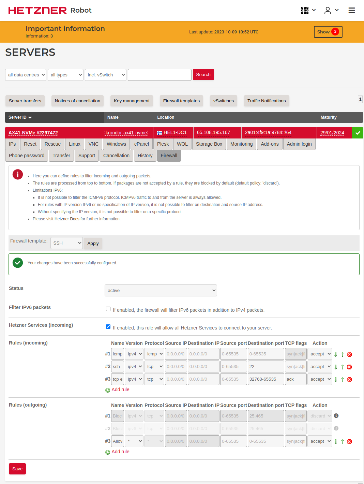
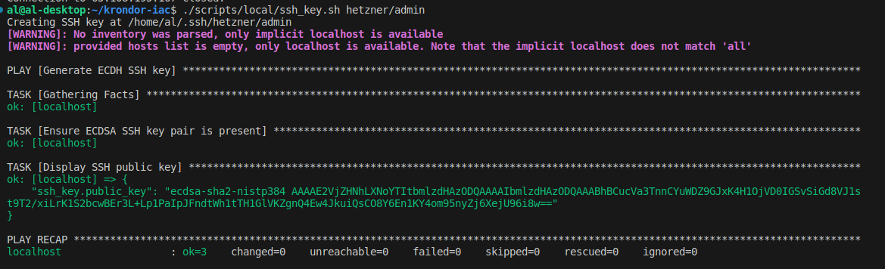
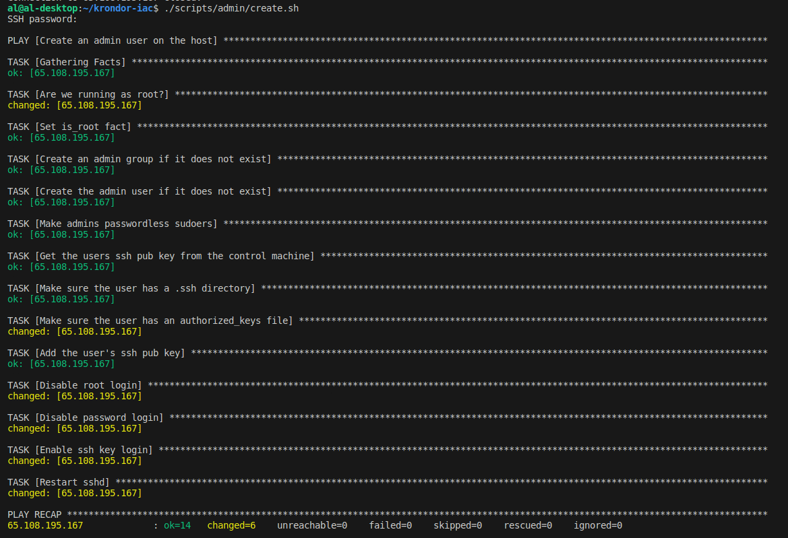
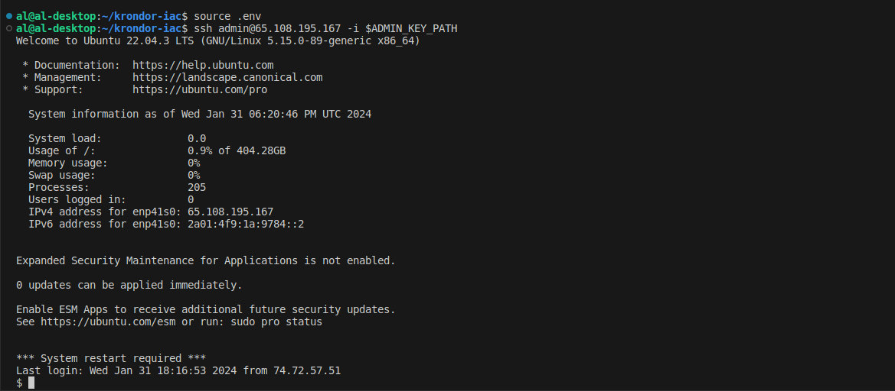
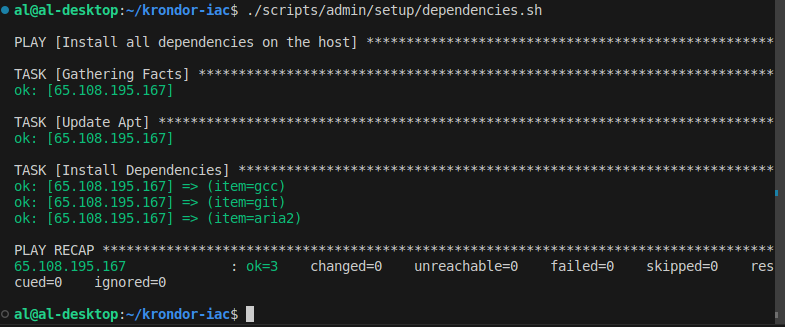
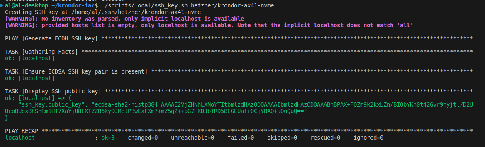
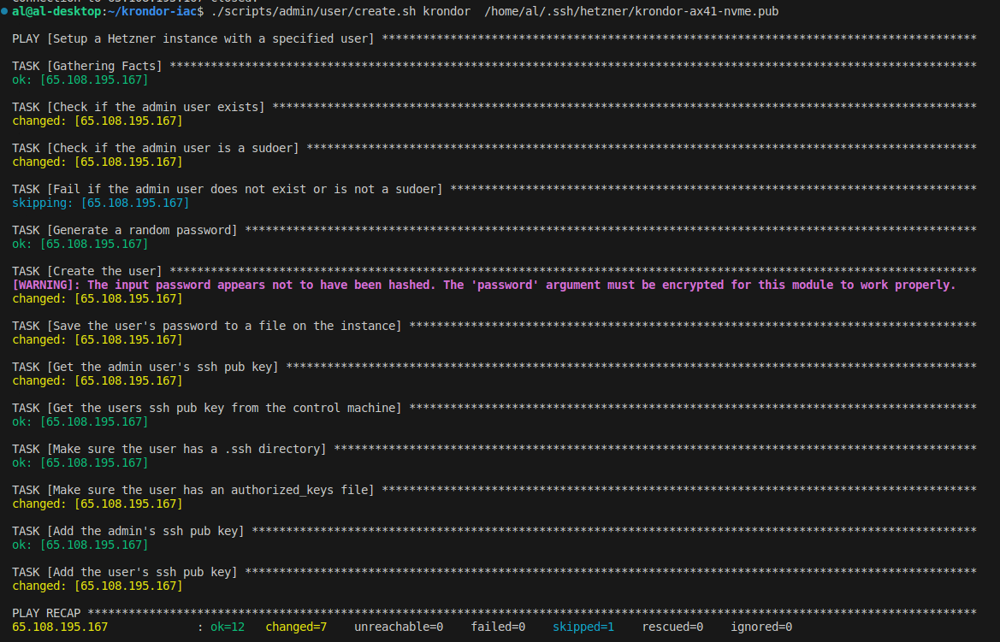
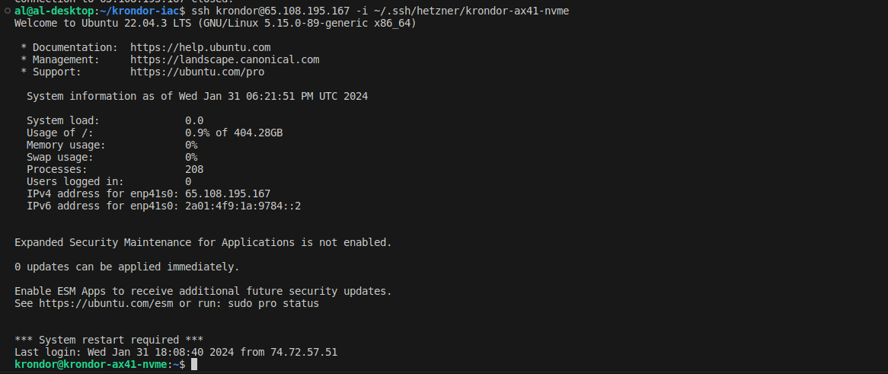

# Hetzner Dedicated Server: Basic SSH Setup

This walkthrough describes how to initially set up a Hetzner server to act as a secure SSH service for you and any users you'd like to provide access to.
At the end you should have a secure base to which start adminstering the server for providing additional services.
More configuration scripts will follow as I have time to implement and deploy more services.

Note, this walkthrough (other than the install image portion, firewall setup) is generally applicable to any Ubuntu server.
However, you should be sure to implement a comparable firewall to the one described here! If you don't have a tool of choice [ufw](https://help.ubuntu.com/community/UFW) should come with your install of Ubuntu, and is more or less fine.

This rest of this walkthrough assumes:
- you have made a [Hetzner](https://www.hetzner.com/) account and passed their screening process
- you have successfully configured and recieved access to a dedicated server of your choice
- you chose the PASSWORD option when specifying a route for initial access to your server

## Notes

You might run into `unknown host` errors with ssh as you progress through the walkthrough. This is normal, due to the server's fingerprint changing as we configure it. Just listen to the error messages and you will be fine.

## Requirements
You should have the following installed before continuing:
- [Python](https://www.python.org/downloads/)
- [Anisble](https://docs.Anisble.com/Anisble/latest/installation_guide/intro_installation.html)

## Overview
- Setting up a basic SSH firewall
- Installing a new image
- Create an admin
- Connect as an admin and run administrative playbooks
- Create a user as an admin
- Connect as a user
- Wrap up

## Setting up a basic SSH firewall

Keep it simple! Hetzner already has useful tools for configuring firewalls for your dedicated server. For our purposes we can just configure their template SSH server firewall before we continue. 

First, go and log in to your [Hetzner Robot Console](https://robot.hetzner.com/server). Navigate to the `Firewall` tab for the server you want to setup and setup the default SSH template before continuing:



This should only allow connecting to the server over SSH, and allow the server to make routine outbound TCP requests and recieve responses over user-space ports. This should suffice for now.

## Installing a new image

First: when you first activate your server, it should be in 'Rescue Mode'. Your server's `root` user should have a password associated with it that will allow you to access `root` over SSH. Navigate to the `Rescue` tab and grab this -- we'll call it `PASSWORD`. You also have an public IP address for your server listed somewhere in the console's UI, it should be pretty easy to find. Call this value `IP`. Also decide on a unique, readable name to call your server -- this will be helpful later. Call this value `HOSTNAME`.

First try connecting to `root` over SSH:

```bash
$ ssh root@<IP>
```

You should be prompted to enter `PASSWORD`, after which you will be granted root shell access to the server. From here you can install a new OS and format your drives using the nifty `installimage` tool provided by Hetzner. Run:

```sh
$ installimage
```

to get started. It might be hard to recover from decisions made here if they end up being wrong for your use case. Make sure you know how what your requirements are and how to configure your server for those requirements before continuing. For example, I ran through this initial setup on an [AX41-NVME](https://www.hetzner.com/dedicated-rootserver/ax41-nvme/) server, with 2 X 512 GiB SSDs and 64 GiB of RAM. I decided to install Ubuntu 22.04.2 LTS (Jammy Jellyfish). I made the following choices when configuring my requirements and configuration:
- I'm familiar with Ubuntu and it fulfills my usecase of setting up a simple SSH server, so I decided to install Ubuntu LTS.
- I figured I might want to eventually use this server as a place host my content, so I wanted my drives to operate in RAID 1 for increased redundancy (both drives would have to fail for me to lose all of my data). Hetnzer actually configures this by default for my instance, so I didn't need to change anything here.
- I like my hostnames to be descriptive when in the terminal, so I changed mine to the `HOSTNAME` I came up with earlier (mine is 'krondor-ax41-nvme')
- I do believe Ubuntu recommends a GiB of `swap` space for every GiB of RAM, so I upped Hetzner's default 32 GiB to 64 GiB

If you're setting up a simple service this should not be such a big deal, but if you plan on doing anything specialized or complex I would research more before committing to a configuration, as going through this process will require you to reformat and erase disk space. There's no shame on exiting from `installimage` if you're confused! It's better to be more sure of what you're doing.

After progressing through the GUI, the program will begin provisioning your server for you. Once that succeeds you can call `reboot`, wait for the server to come back online, and continue.

## Create an Admin

At this point you should have a provisioned Ubuntu server available at your `IP` address. The server should be accessible as `root` using the `PASSWORD` you wrote down from the last section (if you misplaced this, there should be a copy in an email from Hetzner as well).

But we can do better:
- We don't want to have `root` be the user with which we interact and administer this server. This is a dangerous and error prone approach -- always try and respect the [principle of least privilege](https://csrc.nist.gov/glossary/term/least_privilege)! We should create non-`root` admins that can administer the server and users that will actually use its resources. 
- Let's also prohibit logging in with root to be on the safe side.
- We want to enable access to our server through asycnhronous [SSH keys](https://www.ssh.com/academy/ssh-keys). Not only do keys making runnning commands more convenient, they offer increased security over password authentication.
- We should also go a step further and prohibit access to the server over SSH with a password.

I found myself needing to implement this policiy so often when setting up servers and running benchmarks, that I decided to automate almost all of it with Anisble and bash scripts. We'll start by configuring and creating an `admin` user on the server:

1. Create an SSH key for the admin by running:
```sh
$ ./scripts/local/ssh_key.sh hetzner/admin
```

You should see the following in your terminal:



This will create a new ECDSA SSH public-private key pair on your local machine at `~/.ssh/hetnzer/admin.pub` and `~/.ssh/hetnzer/admin`. We'll use this for controlling access to the `admin` user we will create. Only keep this key on machines you trust!

2. Copy `.env.sample` to `.env`. We'll need to configure this more later, but this should be fine for now.

3. Creat the admin user. Run:

```sh
$ ./scripts/admin/create.sh
```

You'll be prompted for a password. You should use the `PASSWORD` value from before. You will never need this again after this playbook exits successfuly. You should see the following in your terminal:



Congratulations! You just created an `admin` user, gave them the proper permissions to administer your server (made them a passwordless sudoer), authorized the SSH key we created to access the account, disbaled root-login, and disabled password login! That was easy, and now your server is more secure and set up with an administrator.

## Connect as an admin and run administrative playbooks

Let's try logging in as `admin` with:

```sh
$ source .env
$ ssh admin@<IP> -i $ADMIN_KEY_PATH
```

You should see the following in your terminal:



Hooray! As a passwordless sudoer, the `admin` user has the ability to enter a `root` shell with `sudo -s`, allowing them to perform routine maintenance and secure the server. However, we can also leverage Anisble to do that as well while:
- avoiding possibly nasty side effects -- Anisble is great for ensuring state, it doesn't just absent-mindedly run commands!
- explicitly documenting what has been configured on a server through playbooks

For example, we can install common dependencies as a sudoer and make them available to all users. Try running:

```sh
$ ./scripts/admin/dependencies.sh
```

You should see the following in your terminal:



This makes it easy to standardize what packages your users have access to.
Moreover, If your users require further packages you can always extend the underlying playbook and re-run this script.
If you keep these scripts in a repository, these changes will be tracked and version controlled.

## Create a user as an admin

Ok, so now you have a secure server, an `admin` user, and some basic packages. But having an `admin` is not enough -- you wouldn't want to hand out the credentials for this user (since whoever has them has control over your server), nor would you want to perform day-to-day tasks with it. It's best to respect the principle of least privilege and run services and provide resources to users within lesser-privileged accounts on the server. This reduces the complexity of reasoning about server behavior and makes your server more secure by making it harder for potentially malicious services and users to [escalate their privileges](https://en.wikipedia.org/wiki/Privilege_escalation)

We should create another user to interact with the server with day-to-day. Let's see how we can go about creating this user. First:

1. Create an SSH key for our new user by running:
```sh
$ ./scripts/local/ssh_key.sh hetzner/<HOSTNAME>
```

You should see something similar to the following in your terminal:



This will create a new ECDSA SSH public-private key pair on your local machine at `~/.ssh/hetnzer/<HOSTNAME>.pub` and `~/.ssh/hetnzer/<HOSTNAME>`. We'll use this for controlling access to the user we will create.

2. Now we can go ahead and create user we want. Think of a good `<USER_NAME>` to for your user. Now try runing:

```sh
$ ./admin/user/create.sh <USER_NAME> ~/.ssh/hetnzer/<HOSTNAME>.pub 
```

You should see something similar to the following in your terminal:



Congrats! With this command you created a new user called `<USER_NAME>` and added the SSH key we created before as an authorized key for their account (you also made the admin key able to access your new user's account). Now you have a user with appropriate privileges for accessing basic non-sudo commands and packages, and which can easily and securely access your server.

## Connect as a user

All that's left is to connect to your user with the following command:

```sh
$ ssh <USER_NAME>@<IP> -i ~/.ssh/hetnzer/<HOSTNAME>
```

You should see something similar to the following in your terminal:



Now you can get started actually using the server you're renting! It seems kinda silly it took all of this time and scripting, but hopefully following this walkthrough was straighforward and helped you uphold secure server policies.

## Wrap Up

Before you get up from your desk, its very important that you  B A C K U P    Y O U R    K E Y S !!!
If you don't have one already, I highly recommend that you look into getting a password and / or key manager for this. I can recommend [1Password](https://1password.com/) especially when it comes to keeping SSH keys secure and sharing them with other people if needed. So long as you have access to your keys you should be able to securely access your server. If you lose them you may have to put your server in recovery mode and potenitially lose important data!
 
I hope you enjoyed the walkthrough, and maybe learned a lil something. Thanks for reading!