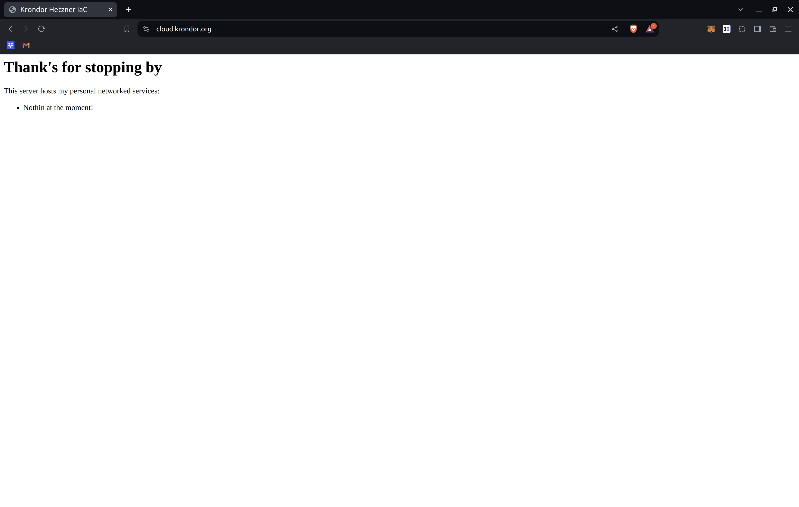

# Hetzner Dedicated Server: Static Nginx Site

This walkthrough describes how to initially set up a Hetzner server to act as a static web server. We'll also setup HTTPS while we're at it.
At the end you should have a "secure" static site that you can point to with a domain you manage. This is meant as a template tool with which to build more complex services, but right off the bat you can start getting a handle on LetsEncrypt and NginX.

This rest of this walkthrough assumes:
- you completed the setup described in [the first walkthrough](./ssh_setup.md)
- you own a domain that you have the permissions to manage DNS for.

## Requirements
You should have the following installed before continuing:
- [Python](https://www.python.org/downloads/)
- [Anisble](https://docs.Anisble.com/Anisble/latest/installation_guide/intro_installation.html)

## Overview
- Setting up a basic Web Server firewall
- Configuring your domain
- Initializing Nginx
- Starting Nginx
- Wrap up

## Setting up a basic Web Server firewall

Keep it simple! Hetzner already has useful tools for configuring firewalls for your dedicated server. For our purposes we can just configure their template Web server firewall before we continue. 

First, go and log in to your [Hetzner Robot Console](https://robot.hetzner.com/server). Navigate to the `Firewall` tab for the server you want and setup the default Web Server template on top of the SSH firewall we already set up before continuing.

This should allow connecting to the server over HTTP and HTTPS, and allow the server to make routine outbound TCP requests and recieve responses over user-space ports.

## Configuring your domain

You'll need a domain to point to your web sever. In order to do so you'll need to create an A record for the (sub) domain you want to point at your webservice, and set the value to the public IP address of your server. 

Once you've done this you can validate whether or not DNS is working by calling `dig` from the command line. For example, my server's IP address is `65.108.195.167` and my domain is `cloud.krondor.org`. My response contains the following:

```shell
al@al-XPS-13-9310:~/krondor-hetzner-iac$ dig cloud.krondor.org

; <<>> DiG 9.16.1-Ubuntu <<>> cloud.krondor.org
;; global options: +cmd
;; Got answer:
;; ->>HEADER<<- opcode: QUERY, status: NOERROR, id: 49570
;; flags: qr rd ra; QUERY: 1, ANSWER: 1, AUTHORITY: 0, ADDITIONAL: 1

;; OPT PSEUDOSECTION:
; EDNS: version: 0, flags:; udp: 65494
;; QUESTION SECTION:
;cloud.krondor.org.		IN	A

;; ANSWER SECTION:
cloud.krondor.org.	300	IN	A	65.108.195.167

;; Query time: 283 msec
;; SERVER: 127.0.0.53#53(127.0.0.53)
;; WHEN: Wed Feb 07 19:26:43 EST 2024
;; MSG SIZE  rcvd: 62
```

Great! We're ready to set up our web service

## Initializng Nginx

The next couple steps are easy. First you'll need to configure your `.env` file to specify the domain you pointed at your server, as well as provide a valid email address to advertise as an admin contact for your service. The relevant sections of my config look like:

```
...
# What domain to use for exposing up web services. This one is mine
export DOMAIN=cloud.krondor.org
# What email to use for publishing on web service certs. This one is mine
export EMAIL=al@krondor.org
```

We already installed Nginx when we set up dependencies on our server in the first walkthrough.
The following script should handle initializing Nginx with a basic config, static files, and a valid SSL certificate for terminating TLS.

If you run:

```shell
$ ./scripts/admin/nginx.sh 
```

This should handle properly configuring Nginx, creating an SSL certifcate for our domain, and starting our web server. Take a look at some of the tasks called from the [relevant playbook](../../../ansible/admin/nginx/tasks.yml):

```
...

# Copy our static web server to the host within our Nginx configuration and enable the site
- name: Copy static site files assets
  become: yes
  template:
    src: ./static/index.html.j2
    dest: "/var/www/html/{{ domain }}/index.html"
    owner:  www-data
    group: www-data
    mode: 0643
- name: Setup server block
  become: yes
  template:
    src: ./config.j2
    dest: "/etc/nginx/sites-available/{{ domain }}"
- name: Enable the server block
  become: yes
  file:
    src: "/etc/nginx/sites-available/{{ domain }}"
    dest: "/etc/nginx/sites-enabled/{{ domain }}"
    state: link

# This uses Let's Encrypt in order to set up a valid SSL certifcate for our domain, which is pointing to our host
#  We reference this certifcate in our site configuration so that our host can serve HTTPS requests over our domain
- name: Setup domain SSL certificate
  import_tasks: ./ssl.tasks.yml
  vars:
    target_domain: "{{ domain }}"
    email: "{{ email }}"
```

You should see something like the following in your console:

```shell
PLAY [Init our services on the host] **************************************************************************

TASK [Gathering Facts] ****************************************************************************************
ok: [65.108.195.167]

TASK [Debug] **************************************************************************************************
ok: [65.108.195.167] => {
    "msg": [
        "Init Nginx Configuration",
        "al@krondor.org",
        "cloud.krondor.org"
    ]
}

TASK [Remove default Nginx configuration] *********************************************************************
ok: [65.108.195.167]

TASK [Copy static site files assets] **************************************************************************
ok: [65.108.195.167]

TASK [Setup server block] *************************************************************************************
ok: [65.108.195.167]

TASK [Enable the server block] ********************************************************************************
ok: [65.108.195.167]

TASK [Debug] **************************************************************************************************
ok: [65.108.195.167] => {
    "msg": [
        "Creating SSL Cert for cloud.krondor.org",
        "Admin Email: al@krondor.org"
    ]
}

TASK [Check if the SSL certificate already exists] ************************************************************
ok: [65.108.195.167]

TASK [Generate Let's Encrypt certificate] ********************************************************
## Starting Nginx

We're now ready to start up our services. Run:

```shell
$ ./scripts/admin/start.sh 
```

This should start all of the services provided by our host. You should see something like the following in your console:

```shell
PLAY [Start our services on the host] **************************************************************************************************************************************************

TASK [Gathering Facts] *****************************************************************************************************************************************************************
ok: [65.108.195.167]

TASK [restart_nginx] *******************************************************************************************************************************************************************
changed: [65.108.195.167]

PLAY RECAP *****************************************************************************************************************************************************************************
65.108.195.167             : ok=2    changed=1    unreachable=0    failed=0    skipped=0    rescued=0    ignored=0 *************
skipping: [65.108.195.167]

TASK [Add a cronn job to auto renew certificates if one doesn't already exist] ********************************
skipping: [65.108.195.167]

...

TASK [Restart Nginx] ******************************************************************************************
changed: [65.108.195.167]

PLAY RECAP ****************************************************************************************************
65.108.195.167             : ok=14   changed=2    unreachable=0    failed=0    skipped=9    rescued=0    ignored=0
``` 

Great! Nginx is properly configured to serve static content from our domain over HTTPS!

## Wrap Up

Congratulations! You just deployed a simple static website over HTTPS on your own dedicated infrastructure. If you navigate to your domain you should see our placeholder HTML:

