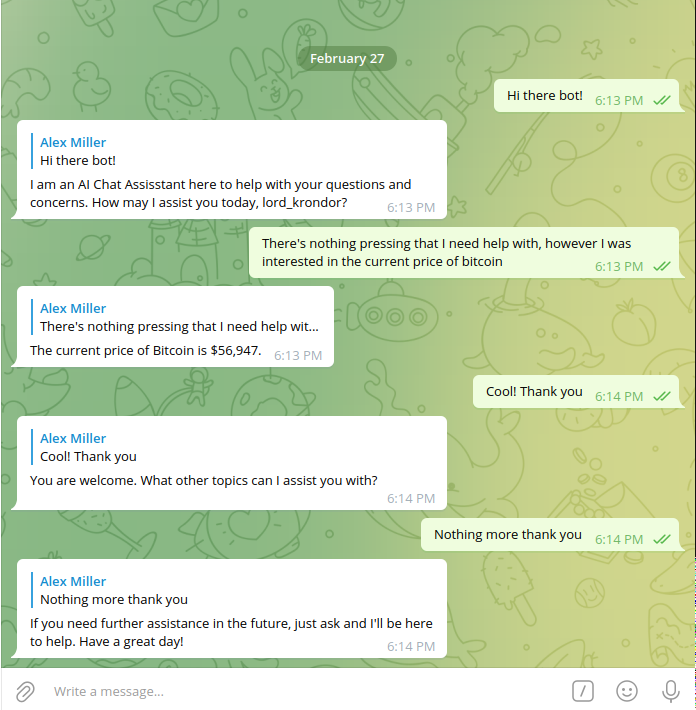

# Hetzner Dedicated Server: Simple AI powered Telegram Bot deployment

This walkthrough describes how to set up a Hetzner with a Telegram Bot powered by a decentralized AI model. At the end you should have a Telegram Bot running on your own infrastructure that can chat with and handle tasks for users over Telegram. You can go check out the example bot [here](https://t.me/krondor_bot).

Our bot is built on top of Libertai's decentralized AI infrastructure. You can learn more about Libertai [here](https://libertai.io/).

This rest of this walkthrough assumes:
- you completed the setup described in [the first walkthrough](./ssh_setup.md)

## Requirements
You should have the following installed before continuing:
- [Python](https://www.python.org/downloads/)
- [Anisble](https://docs.Anisble.com/Anisble/latest/installation_guide/intro_installation.html)

## Overview
- Updating Dependencies
- Setting up our Chatbot
- Running our Chatbot
- Wrap up

## Updating Dependencies

Our Telegram is built in Python using the [python-telegram-bot](https://pypi.org/project/pyTelegramBotAPI/) library. We need to make sure our instance has Python3 installed before we continue.

Since the first walkthrough we've added some dependencies to our server. Notably, in `./ansible/admin/dependencies.yml` we've added the following:

```yaml
...
    - python3
    - python3-pip
```

Please run the following to update our server's dependencies:

```shell
$ ./scripts/admin/dependencies.sh
```

You should see something like the following in your console:

```shell
PLAY [Install all dependencies on the host] ******************************************************************************

TASK [Gathering Facts] ***************************************************************************************************
ok: [65.108.195.167]

TASK [Update Apt] ********************************************************************************************************
ok: [65.108.195.167]

TASK [Install Dependencies] **********************************************************************************************
ok: [65.108.195.167] => (item=gcc)
ok: [65.108.195.167] => (item=git)
ok: [65.108.195.167] => (item=aria2)
ok: [65.108.195.167] => (item=nginx)
ok: [65.108.195.167] => (item=certbot)
ok: [65.108.195.167] => (item=python3-certbot-nginx)
ok: [65.108.195.167] => (item=openssl)
ok: [65.108.195.167] => (item=apache2-utils)
ok: [65.108.195.167] => (item=python3)
ok: [65.108.195.167] => (item=python3-pip)

PLAY RECAP ***************************************************************************************************************
65.108.195.167             : ok=3    changed=0    unreachable=0    failed=0    skipped=0    rescued=0    ignored=0   
```

Huh! It looks like we've already installed Python3 and pip3 on my server. This is great! We can now move on to setting up our chatbot.

## Setting up our Chatbot

The only thing you need to do to set up our chatbot is to create a new bot on Telegram and get an API key for it. You can do this by following the instructions [here](https://core.telegram.org/bots#6-botfather). Once you've done that, you should have a token that looks something like `123456:ABC-DEF1234ghIkl-zyx57W2v1u123ew11`.

Note: In order for your bot to be able to send and receive messages within a group, you'll need to add disable privacy mode for your bot. You can do this by messaging the BotFather.

Once you have your token, make sure it's present in your `.env` file at the root of this project. It should look something like this:

```shell
export TG_TOKEN=123456:My-Telegram-Bot-Token
```

## Running our Chatbot

Now that we have our bot set up, we can run it on our server. We'll use the `./scripts/admin/telgram_bot.sh` script to do this. This script will install our python dependencies within a virtual environment and then run our bot as a service.

```shell
$ ./scripts/admin/telegram_bot.sh
```

You should see something like the following in your console:

```shell
TASK [Make sure the service user has a .ssh directory] *****************************************************************************************************************************************************************************************************************************
skipping: [65.108.195.167]

TASK [Make sure the service user has an authorized_keys file] **********************************************************************************************************************************************************************************************************************
skipping: [65.108.195.167]

TASK [Add the admin's ssh pub key] *************************************************************************************************************************************************************************************************************************************************
skipping: [65.108.195.167]

TASK [Check if the /home/telegram_bot/krondor-bot directory exists] ****************************************************************************************************************************************************************************************************************
ok: [65.108.195.167]

TASK [Clone the krondor-bot repository] ********************************************************************************************************************************************************************************************************************************************
skipping: [65.108.195.167]

TASK [install the telegram bot dependencies] ***************************************************************************************************************************************************************************************************************************************
skipping: [65.108.195.167]

TASK [Copy the TG Token to the bot's directory with User Input] ********************************************************************************************************************************************************************************************************************
skipping: [65.108.195.167]

TASK [Create a systemd service for telegram_bot] ***********************************************************************************************************************************************************************************************************************************
skipping: [65.108.195.167]

TASK [Reload systemd] **************************************************************************************************************************************************************************************************************************************************************
skipping: [65.108.195.167]

TASK [Enable the telegram_bot service] *********************************************************************************************************************************************************************************************************************************************
skipping: [65.108.195.167]

TASK [Start the telegram bot service] **********************************************************************************************************************************************************************************************************************************************
changed: [65.108.195.167]

PLAY RECAP *************************************************************************************************************************************************************************************************************************************************************************
65.108.195.167             : ok=4    changed=2    unreachable=0    failed=0    skipped=13   rescued=0    ignored=0  
```

If you see something like the above, then your bot should be running on your server. You can check by sending a message to your bot on Telegram. If you see a response, then you're good to go!

Let's try saying "Hello" to our bot in telegram:



Wow! It looks like our bot is working! We can now interact with a decentralized AI model over Telegram. This is a great foundation for building networked responsive applications on top of AI by leveraging the power of Telegram's APIs.

## Wrap Up

Congratulations! You should now have your own Telegram bot running on your Hetzner server. You can now use this bot to chat with and handle tasks for users over Telegram. In future walkthroughs we'll work on upgrading this from a simple chatbot to a more complex AI model that can handle more complex tasks, and maybe act like a personal assistant. Stay tuned!

In the meantime, you can check out the example bot [here](https://t.me/krondor_bot), peak at the code [here](https://github.com/amiller68/), or check out the Libertai project [here](https://libertai.io/). Thanks for reading!
